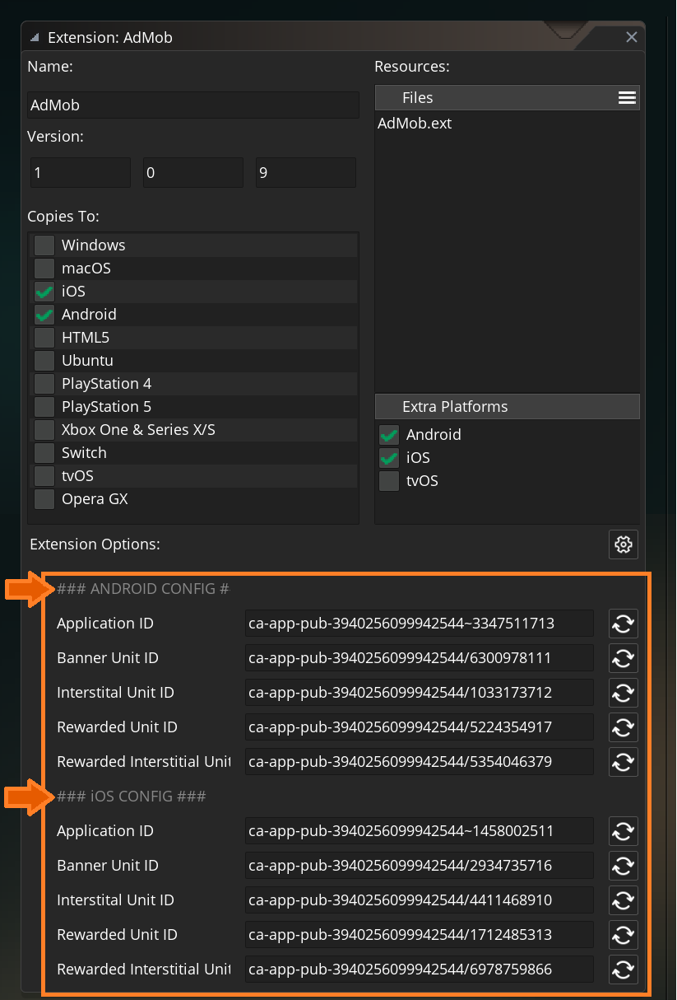

# Setup [NEW]

The AdMob extension is to be used alongside your Google AdMob account ([web page](https://admob.google.com/home/)). All the required personal ad ids and consent messages should be handled through there.

Once AdMob is correctly configured under the Google Dashboard you should be able to fill in the necessary data values in the extension options panels for the AdMob extension.

 

> [!WARNING]
>
> To build and deploy to iOS it’s required for the developer to install CocoaPods. ([installation guide](https://help.yoyogames.com/hc/en-us/articles/360008958858-iOS-and-tvOS-Using-Cocoa-Pods))

 

1. For GDPR consent you should look to follow the options below:\
`AdMob Console` → `Privacy and Messaging` → `Go to funding choices` → `(select your project)` → `Create (new message)` → `EU Consent` → fill all the necessary details.
2. For setting up the AdMob extension you should use the new extension options accessible from double clicking the extension on the IDE. Here you are presented with options to configure both the **Android** and the **iOS** exports.

Just replace the **Application ID** with your Google Application ID and use your personal Ad UnitIDs (for **Banners**, **Interstitial**, **Rewarded** and **Rewarded Interstitial**)
